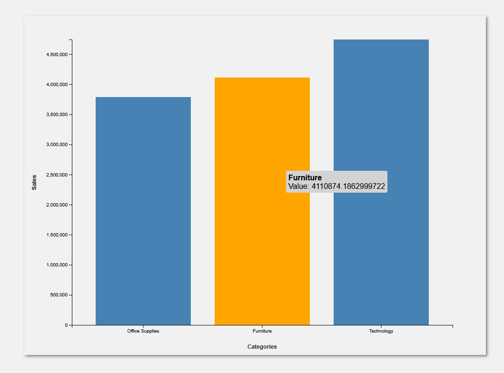
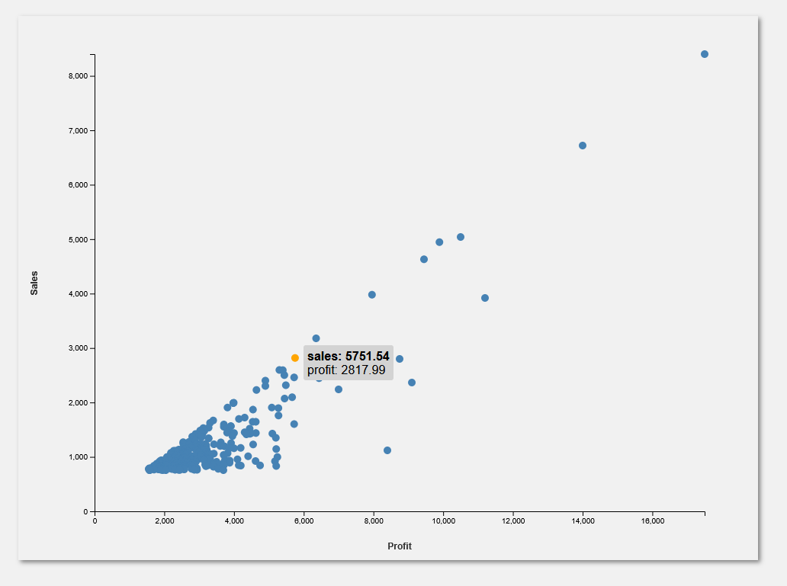
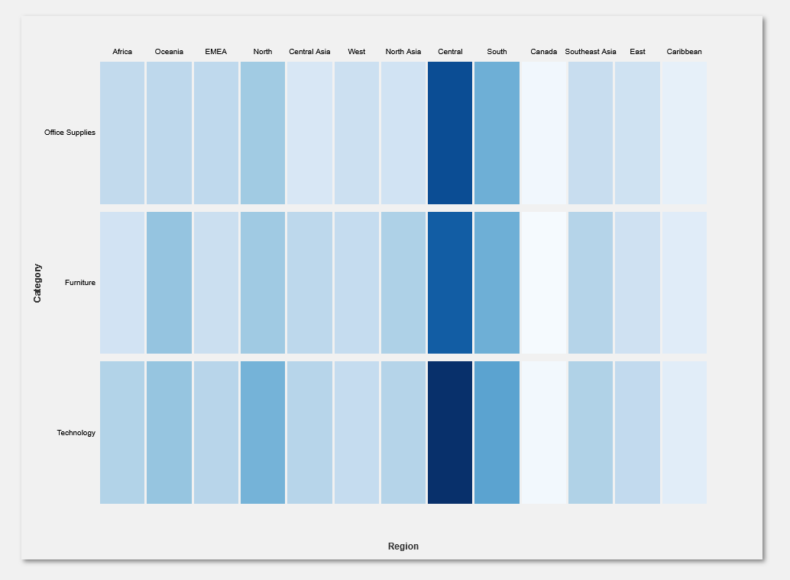

# Data Visualization Assignment 1

## Overview

This is the first assignment for the Data Visualization class.
For this project, the aim was to build 3 specific types of visualizations using the [D3.js](https://d3js.org/) library for a _dataset_ specified by the professor. This _dataset_ is a known _dataset_ for stores.
The specific visualizations asked were:

- **Scatter Plot**
- **Bar chart**
- **Heatmap**

## Project

This project uses the simple yet effective triad of **HTML**, **CSS** and _vanilla_ **JS** along with the **D3.js** library.

### 1. Objective

The objective for this assignment is to **get experience** with _data visualization_ and **learn the foundational principles** to implement meaningful views for a set of data. The reason for this project is also to learn how the **D3.js** works and how we can use it.

### 2. Structure

It follows a simple folder structure with:

- It's 3 main elements ([HTML](index.html), [CSS](styles.css) and [JS](main.js)) in the _root_ folder, along with this [README](README.md) file.
- 2 Subfolders for:
  - **Classes:** containing class definition for the [configuration](classes/Config.js) and for each chart type.
  - **Data**: containing a [superstore.json](data/superstore.json) file with the data to be used in this assignment.

### 3. Interface

The interface is composed of 3 main elements:

- **Top Bar:** a _fixed_ bar with information about the assignment.
- **Left Sider Menu:** a menu _(fixed)_ to de left side of the page. This menu contains a _select_ element for each type of graph, each with different context for that type of visualization.
- **Main display:** shows the visualizations/charts rendered.

### 4. Data Visualization

#### 4.1. Bar Chart


_TODO: explain why is it meaningful_

#### 4.2. Scatter Plot


_TODO: explain why is it meaningful_

#### 4.3. Heat Map


_TODO: explain why is it meaningful_

## How to run it

### 1. Clone this repository

```bash
git clone https://github.com/yuri-mascarenhas/trabalho-vis.git
cd trabalho-vis
```

### 2. Execute

#### 2.1 Live Server (Recommended)

If you use **VS Code** (or VS Codium), the easiest way to run this project is trough the **Live Server** extension.

1. Install the **Live Server** extension.
2. Open the project in **VS Code**.
3. Press **ALT+L, ALT+O**.
4. A page should automatically open on your default browser.

### 2.2 Python HTTP Server

In case you already have **Python** installed, you can run a local server with the `http.server` module:

- **Python 3.x**

```bash
python -m http.server 8000
```

- **Python 2.x**

```bash
python -m SimpleHTTPServer 8000
```

After Running one of the commands above, open your browser and access the running project in [http://localhost:8000](http://localhost:8000)

### 2.3 Node.js Server

If you already have **Node.js** installed, you can run a local server with the `http-server` package.

1. Install the package globaly

```bash
npm install -g http-server
```

2. Execute with the package

```
http-server
```
